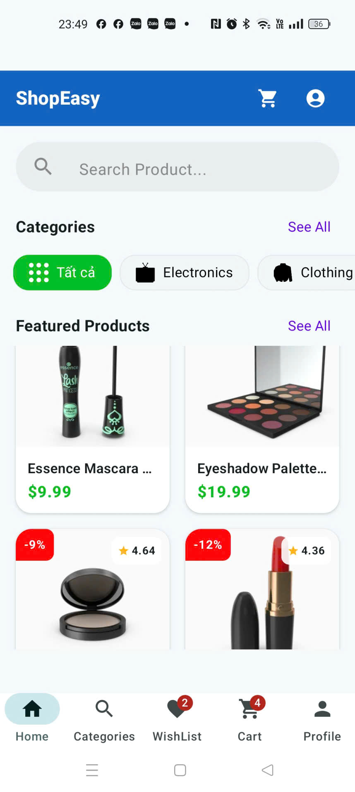
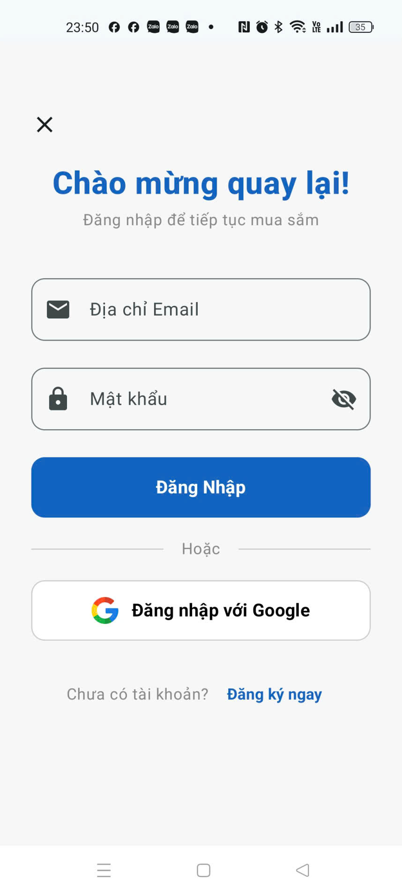
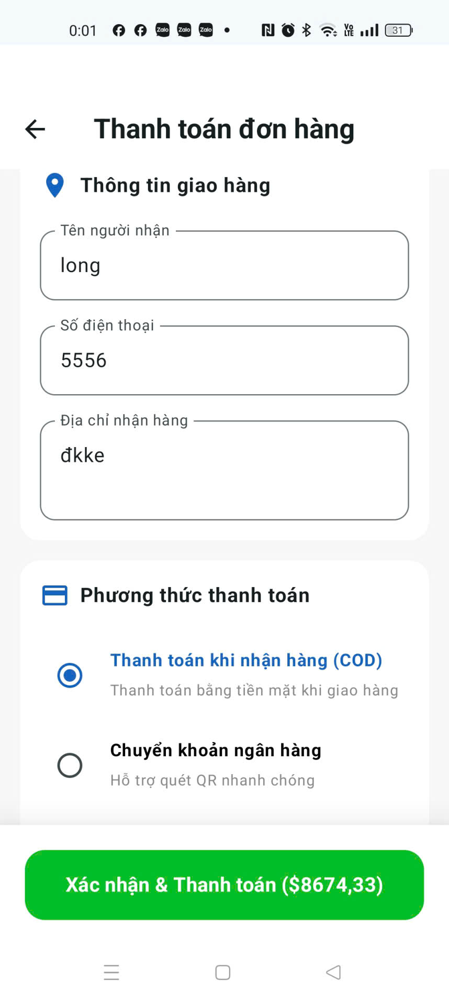
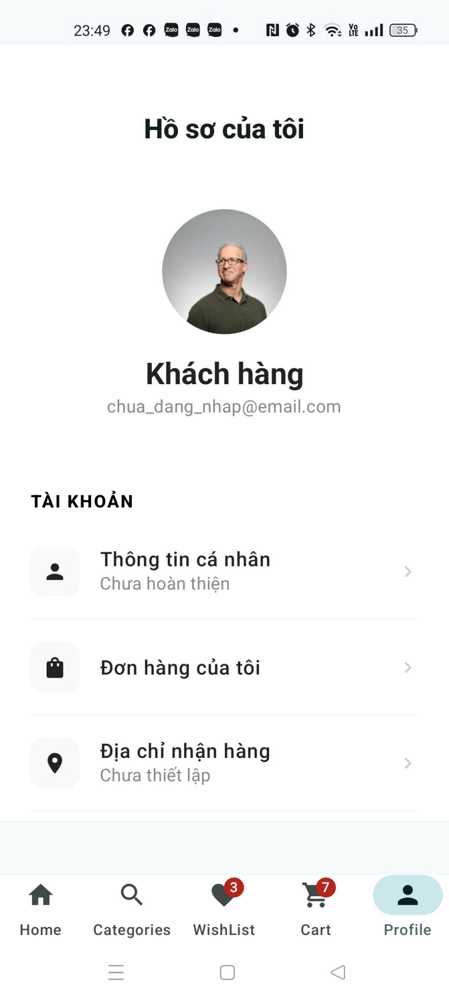
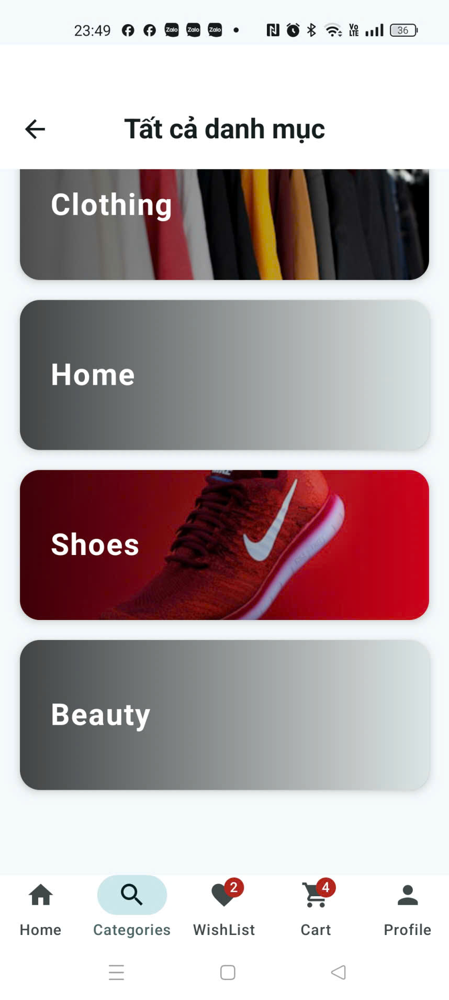
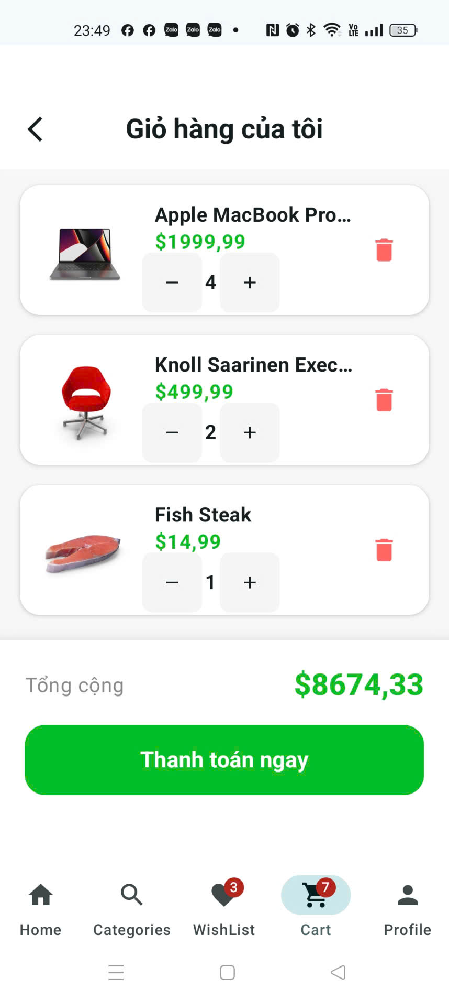
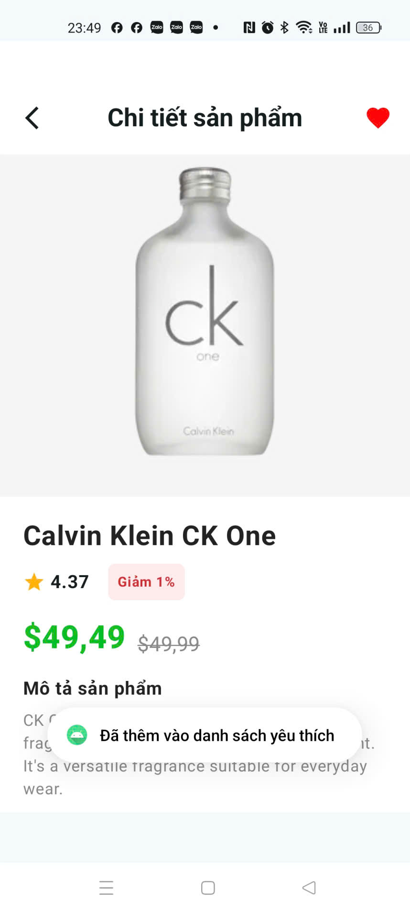

# E-Commerce App - Jetpack Compose & Clean Architecture

An Android E-Commerce application built using **Kotlin**, **Jetpack Compose**, and **Clean Architecture** principles. The app implements dependency injection with **Hilt**, local database caching with **Room**, and cloud synchronization using **Firebase** (with offline-resilient mock fallbacks).

*Ứng dụng Android Thương mại Điện tử được xây dựng bằng **Kotlin**, **Jetpack Compose** và áp dụng nguyên lý thiết kế **Clean Architecture**. Dự án tích hợp Dependency Injection bằng **Hilt**, lưu trữ dữ liệu cục bộ bằng **Room** và đồng bộ hóa đám mây thông qua **Firebase** (có chế độ mô phỏng offline dự phòng).*

---

## 📱 Screenshots & Demo / Hình ảnh & Video chạy thử

### Video Demo
<video src="./image/video.mp4" controls width="100%" style="max-height: 480px; border-radius: 12px;"></video>

[👉 Nhấn vào đây để xem trực tiếp video / Click here to view video directly](./image/video.mp4)

### Screenshots / Hình ảnh giao diện (Width: 200px)
       

---

## Table of Contents / Mục lục
- [English Version](#english-version)
  - [Architecture & Architecture Patterns](#architecture--architecture-patterns)
  - [Key Features](#key-features)
  - [Technology Stack](#technology-stack)
  - [Project Directory Structure](#project-directory-structure)
  - [How to Run the Project](#how-to-run-the-project)
- [Bản tiếng Việt](#bản-tiếng-việt)
  - [Kiến trúc & Mô hình thiết kế](#kiến-trúc--mô-hình-thiết-kế)
  - [Các tính năng chính](#các-tính-năng-chính)
  - [Công nghệ sử dụng](#công-nghệ-sử-dụng)
  - [Cấu trúc thư mục dự án](#cấu-trúc-thư-mục-dự-án)
  - [Cách chạy dự án](#cách-chạy-dự-án)

---

# English Version

## Architecture & Architecture Patterns
The project follows **Clean Architecture** principles split into three major layers:
1. **Data Layer**: Responsible for fetching data from network services (Retrofit) or local persistence (Room / SharedPreferences). Includes implementation classes of repositories.
2. **Domain Layer**: Houses core business logic and rules. It defines repository interfaces and implements single-responsibility **Use Cases**.
3. **Presentation Layer**: Implements **MVVM** pattern using Jetpack Compose for declarative UI, ViewModels to survive configuration changes, and StateFlow to model reactive state.

## Key Features
*   **User Authentication**: Firebase Email & Password sign-in / registration, with Google Sign-in support. Fallback mock login mode runs seamlessly if Google Services or network is absent.
*   **Personal Profile Completion**: Edit and complete profile details (Name, Phone Number, Delivery Address) and select an avatar inside a premium native `ModalBottomSheet`. Data is stored persistently offline via `SharedPreferences` on a per-user basis.
*   **Categories Navigation**: Classifies goods into **5 main groups** (Electronics, Clothing, Home, Shoes, and Beauty) with dedicated screens displaying products for each category group.
*   **Dynamic Wishlist (Favorites)**: Add/remove favorites using a heart toggle in the Product Details app bar. The Bottom Navigation Bar reflects the wishlist size in real-time.
*   **Shopping Cart**: Local persistence of cart items using **Room Database**. Auto-calculates subtotals, allows adjusting quantities, and features a real-time reactive cart count badge on the bottom bar.
*   **Checkout & Payment UI**:
    *   Autofills and saves user delivery details.
    *   Select from multiple payment options: Cash on Delivery (COD), E-Wallet (Momo QR Code), Bank Transfer (MB Bank QR Code & details), and Credit Card.
    *   Includes an interactive virtual Credit Card mockup that updates dynamically as the card details are typed.
*   **Order History & Tracking**: Displays orders listing product thumbnails (via Coil). Tracks explicit payment information (e.g. "COD - Unpaid" or "Momo - Paid") and marks order status with modern colored tags (Processing, Success, Cancelled).

## Technology Stack
*   **UI Framework**: Jetpack Compose (Declarative UI)
*   **Design System**: Material Design 3 (M3)
*   **Asynchronous Processing**: Kotlin Coroutines & Flow
*   **Dependency Injection**: Hilt (Dagger Hilt)
*   **Database (Local)**: Room Database (for Cart item caching)
*   **Preferences (Local)**: SharedPreferences (for User Profile & Wishlist cache)
*   **Image Loading**: Coil 3 (Compose Image Loader)
*   **Networking**: Retrofit 2 & Gson (API services)
*   **Backend Services**: Firebase Auth & Firebase Firestore (Cloud Database)

## Project Directory Structure
```
app/src/main/java/com/example/ecommerceapp/
├── data/
│   ├── local/          # Room Entities, DAOs, Database
│   ├── remote/         # Retrofit API Service & DTOs
│   └── repository/     # Data Repository Implementations
├── di/                 # Hilt Modules (AppModule)
├── domain/
│   ├── model/          # Core Domain Models (Product, CartItem, Order, User)
│   ├── repository/     # Domain Repository Interfaces
│   └── usecase/        # Clean Architecture Use Cases (Auth, Cart, Order, Product)
├── feature/            # Feature-based MVVM components
│   ├── auth/           # Login / Register ViewModels & Screens
│   ├── cart/           # Shopping Cart logic
│   ├── goods/          # Product Details & Image Loaders
│   ├── order/          # Orders list, Checkout & Payment UI
│   └── profile/        # Profile editing and SharedPreferences syncing
├── model/              # Custom View Models & Typealiases
├── screens/            # Global UI Layout components (Bottom Bar, Categories)
└── ui/theme/           # Application Theme (Color, Typography, Shape)
```

## How to Run the Project
1.  **Prerequisites**: Android Studio Jellyfish (or newer), JDK 17.
2.  **Clone & Open**: Open the project folder in Android Studio.
3.  **Firebase Integration (Optional)**: Place your custom `google-services.json` inside the `app/` folder. If absent, the app automatically switches to offline mock mode for authentication, databases, and orders.
4.  **Run**: Connect a physical Android device or start an emulator and press the **Run** button (or execute `./gradlew assembleDebug` in the terminal).

---

# Bản tiếng Việt

## Kiến trúc & Mô hình thiết kế
Dự án được xây dựng theo nguyên lý **Clean Architecture** được chia làm 3 lớp chính:
1. **Data Layer (Lớp dữ liệu)**: Chịu trách nhiệm lấy dữ liệu từ mạng (Retrofit) hoặc bộ nhớ cục bộ (Room / SharedPreferences). Chứa các lớp triển khai cụ thể (Implementation) của Repository.
2. **Domain Layer (Lớp nghiệp vụ)**: Chứa logic cốt lõi của ứng dụng. Định nghĩa các giao diện (Interface) của Repository và các **Use Case** đơn nhiệm.
3. **Presentation Layer (Lớp hiển thị)**: Áp dụng mô hình **MVVM** kết hợp với Jetpack Compose để khai báo giao diện, ViewModel giữ dữ liệu qua vòng đời của màn hình, và StateFlow phát tín hiệu cập nhật giao diện bất đồng bộ.

## Các tính năng chính
*   **Đăng nhập & Đăng ký**: Hỗ trợ đăng nhập bằng Email/Password qua Firebase hoặc đăng nhập bằng tài khoản Google. Tự động chuyển sang chế độ Mock offline hoạt động mượt mà nếu máy ảo không cài đặt Google Services hoặc mất kết nối.
*   **Hoàn thiện thông tin cá nhân**: Cập nhật thông tin chi tiết (Tên, Số điện thoại, Địa chỉ nhận hàng) và lựa chọn ảnh đại diện thông qua một `ModalBottomSheet` hiện đại. Dữ liệu được lưu trữ ngoại tuyến bằng `SharedPreferences` riêng biệt theo từng tài khoản.
*   **Phân loại danh mục (Categories)**: Phân chia mặt hàng thành **5 nhóm chính** (Thiết bị điện tử, Quần áo thời trang, Đồ gia dụng, Giày dép, và Mỹ phẩm làm đẹp) với màn hình lọc sản phẩm tương ứng.
*   **Danh sách yêu thích (Wishlist)**: Bật/tắt trạng thái yêu thích trực quan bằng nút trái tim trên thanh TopAppBar ở chi tiết sản phẩm. Số lượng badge yêu thích cập nhật thời gian thực trên thanh Bottom Navigation.
*   **Giỏ hàng**: Lưu trữ sản phẩm đã chọn cục bộ thông qua **Room Database**. Tự động tính tổng tiền, tùy chỉnh số lượng tăng/giảm và hiển thị badge đếm số lượng giỏ hàng trên thanh điều hướng dưới cùng.
*   **Giao diện Thanh toán & Chọn Phương thức**:
    *   Tự động điền và lưu trữ thông tin nhận hàng của khách hàng.
    *   Hỗ trợ nhiều phương thức: Trực tiếp khi nhận hàng (COD), Chuyển khoản ngân hàng (mb bank kèm số tài khoản & mã QR), Ví điện tử Momo (kèm QR MoMo), và thanh toán bằng thẻ Visa/Mastercard.
    *   Tích hợp thẻ tín dụng ảo 3D trực quan, thay đổi thông tin số thẻ, tên, thời hạn in trên thẻ trực tiếp theo những gì người dùng đang nhập.
*   **Lịch sử đơn hàng**: Liệt kê chi tiết đơn hàng kèm ảnh thu nhỏ của sản phẩm (sử dụng thư viện Coil), hiển thị rõ ràng phương thức thanh toán & trạng thái thanh toán (Ví dụ: "Đã thanh toán" hoặc "Chưa thanh toán (COD)") cùng tag trạng thái đơn hàng đầy màu sắc (Đang xử lý, Thành công, Đã hủy).

## Công nghệ sử dụng
*   **Khung giao diện**: Jetpack Compose (Declarative UI)
*   **Ngôn ngữ thiết kế**: Material Design 3 (M3)
*   **Xử lý bất đồng bộ**: Kotlin Coroutines & Flow
*   **Dependency Injection**: Hilt (Dagger Hilt)
*   **Cơ sở dữ liệu cục bộ**: Room Database (lưu cache giỏ hàng)
*   **Cấu hình cục bộ**: SharedPreferences (lưu cache profile & danh sách yêu thích)
*   **Tải ảnh bất đồng bộ**: Coil 3 (Compose Image Loader)
*   **Kết nối API**: Retrofit 2 & Gson (Dịch vụ mạng)
*   **Dịch vụ lưu trữ đám mây**: Firebase Auth & Firebase Firestore

## Cấu trúc thư mục dự án
```
app/src/main/java/com/example/ecommerceapp/
├── data/
│   ├── local/          # Khởi tạo Room, DAO, Thực thể dữ liệu
│   ├── remote/         # Định nghĩa API Retrofit & DTO
│   └── repository/     # Triển khai thực tế các Repository
├── di/                 # Cấu hình Module cung cấp DI cho Hilt
├── domain/
│   ├── model/          # Thực thể nghiệp vụ (Product, CartItem, Order, User)
│   ├── repository/     # Khai báo Interface của Repository
│   └── usecase/        # Các Use Case nghiệp vụ (Auth, Cart, Order, Product)
├── feature/            # Các gói chức năng (Mô hình MVVM)
│   ├── auth/           # Giao diện Đăng nhập / Đăng ký & ViewModel
│   ├── cart/           # Xử lý Logic giỏ hàng
│   ├── goods/          # Chi tiết sản phẩm & tải ảnh
│   ├── order/          # Quản lý đơn hàng, Giao diện Thanh toán & QR code
│   └── profile/        # Chỉnh sửa hồ sơ cá nhân, đồng bộ SharedPreferences
├── model/              # ViewModels dùng chung & định danh loại dữ liệu
├── screens/            # Các thành phần giao diện chung (Thanh Bottom Bar, Danh mục)
└── ui/theme/           # Cấu hình màu sắc, kiểu chữ cho giao diện M3
```

## Cách chạy dự án
1.  **Yêu cầu**: Android Studio bản Jellyfish trở lên, Java Development Kit (JDK) phiên bản 17.
2.  **Mở dự án**: Mở thư mục dự án EcommerceApp bằng Android Studio.
3.  **Tích hợp Firebase (Tùy chọn)**: Đặt tệp `google-services.json` của bạn vào thư mục `app/`. Nếu không có, ứng dụng sẽ tự động chuyển đổi sang chế độ lưu trữ mô phỏng offline (không yêu cầu cài đặt Firebase).
4.  **Chạy máy ảo/thiết bị thật**: Kết nối thiết bị Android của bạn hoặc khởi động máy ảo, nhấn nút **Run** trong Android Studio (hoặc chạy lệnh `.\gradlew.bat assembleDebug` trên terminal).
